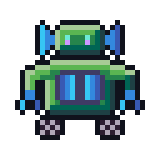
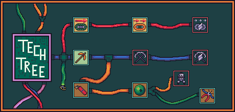

=======
MOB-BOT
=======

.. image:: ./_static/gifs/turing_bot.gif
   :width: 200
   :align: right

As you work for your assigned company (Church Inc. or Turing Co.), you will be coding and upgrading your very
own MOB-BOT. MOB-BOT is a friendly, cute, and efficient robot designed to mine in The Quarry forever! How lovely.

Here are some important notes about MOB-BOT that will help you to improve its functionalities.

Tech Tree
---------

MOB-BOT can undergo a myriad of upgrades that will make it an amazing, mining machine. This tree structure shows
the available upgrade paths and how you can improve.

Here's a description of all the techs. The order goes by row as depicted above:

====================================== =============================================================
Tech Name                              Tech Description
====================================== =============================================================
Better Drivetrains                     This tech will increase your movement, allowing MOB-BOT to move up to 2 tiles per
                                       turn!
Unnamed Drivetrain Tech                Grants an additional movement, allowing MOB-BOT to move up to 3 tiles per turn!
                                       How wonderful!
Overdrive Movement                     The ultimate movement upgrade. MOB-BOT can now move up to 4 tiles per turn!
                                       Burn rubber in that Quarry!
High Yield Drilling                    A decent upgrade from your basic Mining Robotics. MOB-BOT will now gain 2 pieces
                                       of ore when you mine!
Unnamed Mining Tech                    This mysterious new tech brings MOB-BOT's efficiency to a new level. MOB-BOT will
                                       gain 3 pieces of ore when mining! Sensational!
Overdrive Mining                       MOB-BOT has become the mining machine it was always meant to be. MOB-BOT will now
                                       mine 4 ore per turn! Bring in the money!
Dynamite                               Become more efficient with your mining! Dynamite will explode (x) turns after
                                       being placed, mining multiple ores at once!
Landmines                              The other company keeps taking valuable ores, so let's set traps for them...
                                       `>:D` Landmines will steal ores from the opponent when detonated.
EMPs                                   EMPs are the rich Bot's landmine! EMPs will steal more from the opponent than a
                                       normal landmine. Phenomenal!
====================================== =============================================================

For more information on Dynamite, Landmines, and EMPs, go to :doc:`placeables`.
