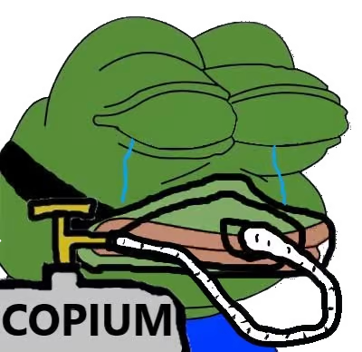

====
Ores
====

Ores are crucial in this game. Not only do they support your respective company's goal of monetary gain and ruling
the technological world, but they also increase your points and allow for you to upgrade your MOB-BOT! Here are
the different ores you can mine.

Copium |copium ore|
-------------------

.. |copium ore| image:: ./_static/images/copium.png
   :width: 35

A very basic ore that's a commodity. Everyone wants Copium. Who doesn't want Copium? |pepe copium|

Mining this ore will yield 1 point.

Lambdium |lambdium|
-------------------

.. |lambdium| image:: ./_static/images/lambdium.png
   :width: 35

Lambium is the favored ore by Church Inc. Lambium is what powers their MOB-BOTs and allows them
to continue research for investing something called 'anonymous functions,' whatever those are.

If you are associated with Church Inc., any Lambdium you mine will yield 10 points! That's a steal!

If you are associated with Turing Co., the Lambdium you mine will be worth 7 points. It's still
valuable, but it's not what you want. It's better than Copium, though!

Turite |turite|
---------------

Turite is the favored ore by Turing Inc. Turite will power Turing Machine-based MOB-BOTs and improve their
systems! Fascinating.

Turing Co. will yield 10 points for every Turite they cash in.

If you are associated with Church Inc., Turite will yield 7 points for you. That's still worthwhile, but, again,
it's better than Copium.

Ancient Tech |ancient tech ore|
-------------------------------

.. |ancient tech ore| image:: ./_static/images/ancient_tech.png
   :width: 35

.. |doors logo| image:: ./_static/images/doors_logo.png
   :width: 15

In The Quarry, there is another strange mineral called Ancient Tech. It's shape is oddly reminiscent of something
from the distant past... |doors logo|

Regardless, Ancient Tech is unique in that it doesn't yield normal points, but scientific points. These points will
allow you to upgrade your MOB-BOT. These upgrades include faster movement speed, placing dynamite, placing traps,
and a few other things. Upgrades are explained more in (avatar).

**(Explain this in avatar and provide a link to it)**
