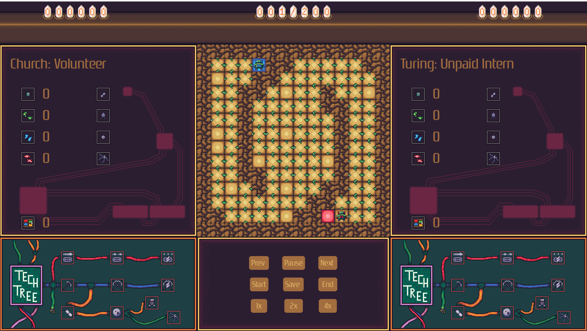

==========
Visualizer
==========

.. raw:: html

   

.. role:: blue

The visualizer is a useful tool that will help visually test your MOB-BOT and what happens in a game. Some
built-in functionalities should help make the coding experience easier too.

The Screen
----------

Here is what the visualizer will look like this year:

The scores are in the top left and top right sections of the screen, showing the scores for Church Inc. and
Turing Co. respectively. The turn counter is in the top center section.

All information for Church Inc. will be on the left and Turing Co. on the right. This includes how much of each ore
each team has, their total science points, which Active Abilities are available to use (they will be colored when
available), their Tech Tree, and which Techs have been unlocked.

(:blue:`Church Inc. MOB-BOT` admiring refined Ancient Tech)

Controls
--------

In the bottom center of the screen there are buttons that will help navigate the playback of the displayed game.

====== ==============================================================================================================
Button Function
====== ==============================================================================================================
Prev   Reverts to the previous turn each time it's clicked. Puts the visualizer in a paused state to allow for
       manual navigation.
Pause  Click once to pause the turn progression and put the visualizer in a paused state. If already in a paused state,
       click to resume playing the game progression from current turn (current turn is affected by Prev and Next).
Next   Progresses to the next turn each time it's clicked. Puts the visualizer in a paused state to allow for manual
       navigation.
Start  Starts the visualizer from the first turn. Puts the visualizer in a paused state, so press Pause to play as
       normal.
Save   Saves a .mp4 video file of the game in your Byte-le 2024 folder. 
End    Jumps to the end of the game to instantly reveal the winner of the game.
Speed  The speed controls are the last three buttons: 1x, 2x, and 4x. They will adjust the speed of the visualizer. The
       default speed is 1x.
====== ==============================================================================================================
